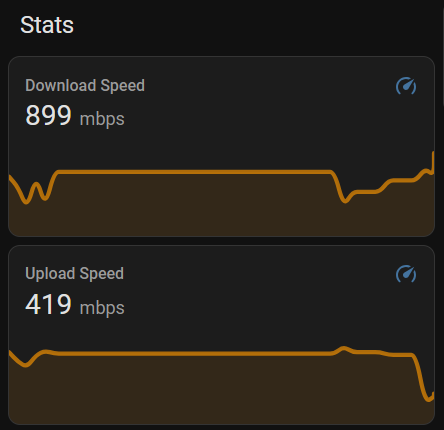

# Cloudflare Speed Tests sent over MQTT

This is a simple Rust program that performs a Cloudflare speed test on a user defined interval and sends the results over MQTT.

Useful to integrate with home assistant for speed test stats on your dashboard.



Inspired by [simonjenny/fastcom-mqtt](https://github.com/simonjenny/fastcom-mqtt), remade in Rust and using Cloudflare's Speedtest instead of Fast.com.

## Usage

Docker images are built and published automatically to the [GitHub Container Registry](https://github.com/artifishvr/cfspeed_mqtt/pkgs/container/cfspeed_mqtt) on push to main.

### Environment Variables

| Name | Description | Required |
| --- | --- | --- |
| MQTT_HOST | Hostname of the MQTT broker | Yes |
| MQTT_PORT | Port of the MQTT broker | Yes |
| MQTT_UPLOAD_TOPIC | Topic to publish upload speeds to | Yes |
| MQTT_DOWNLOAD_TOPIC | Topic to publish download speeds to | Yes |
| TEST_INTERVAL | Interval in seconds to perform a speed test | Yes |

### Example Docker Command

```bash
docker run -d \
  --env MQTT_HOST=my-mqtt-broker.com \
  --env MQTT_PORT=1883 \
  --env MQTT_UPLOAD_TOPIC=speedtestup \
  --env MQTT_DOWNLOAD_TOPIC=speedtestdown \
  --env TEST_INTERVAL=3600 \
   ghcr.io/artifishvr/cfspeed_mqtt:latest
